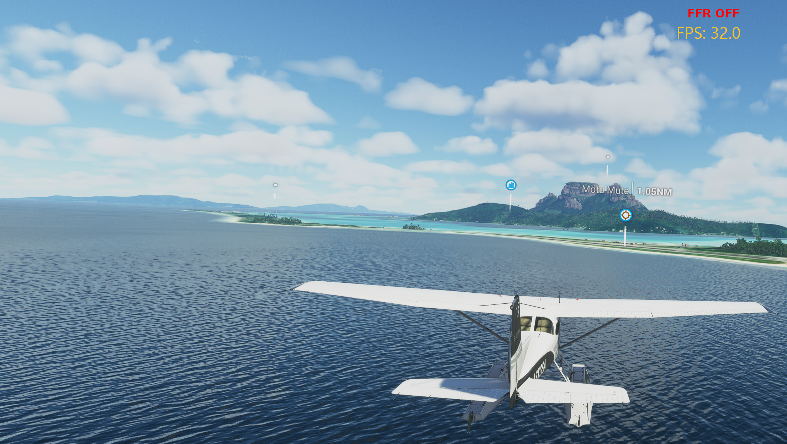
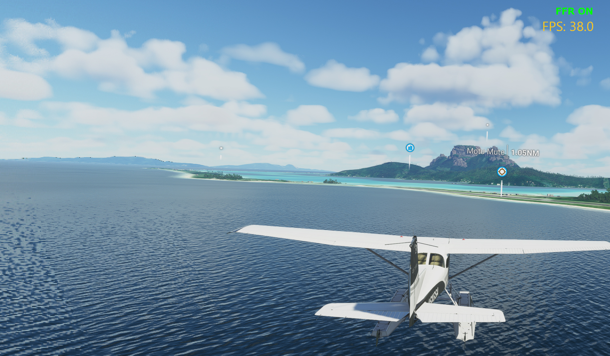
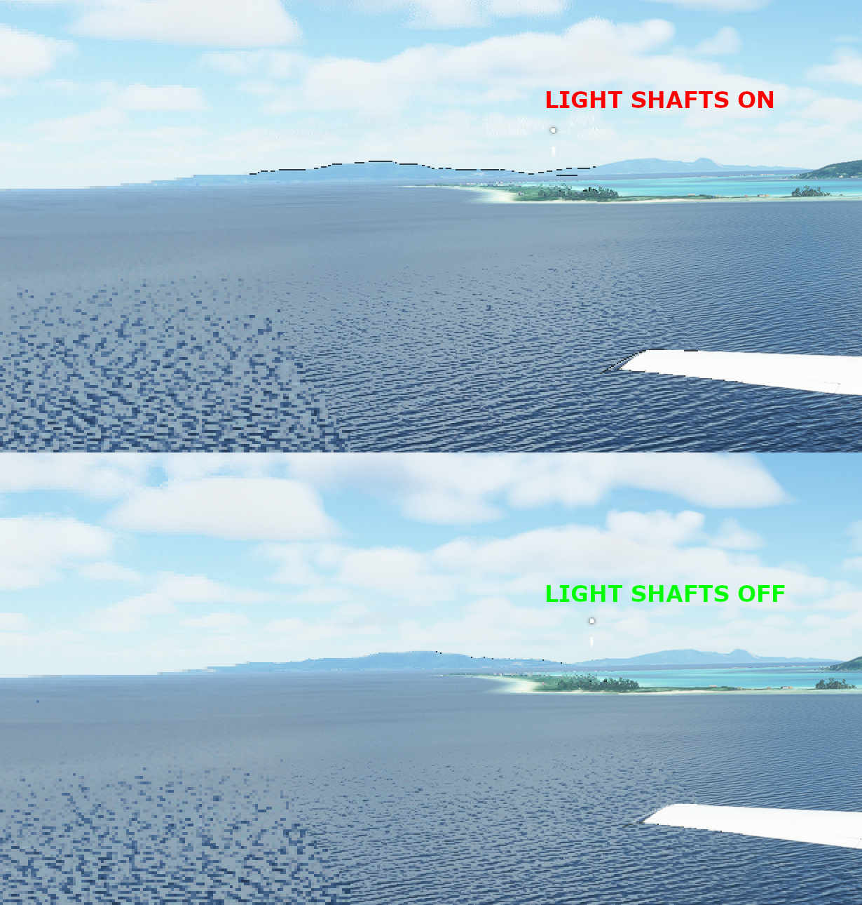
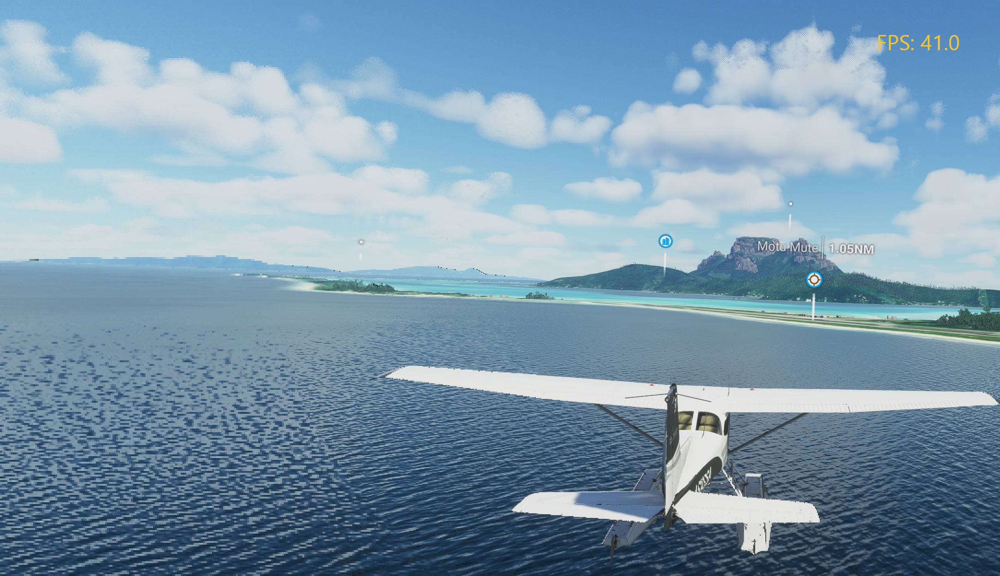
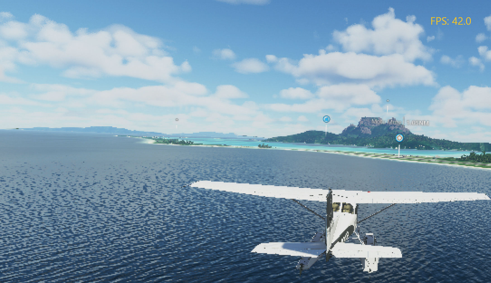
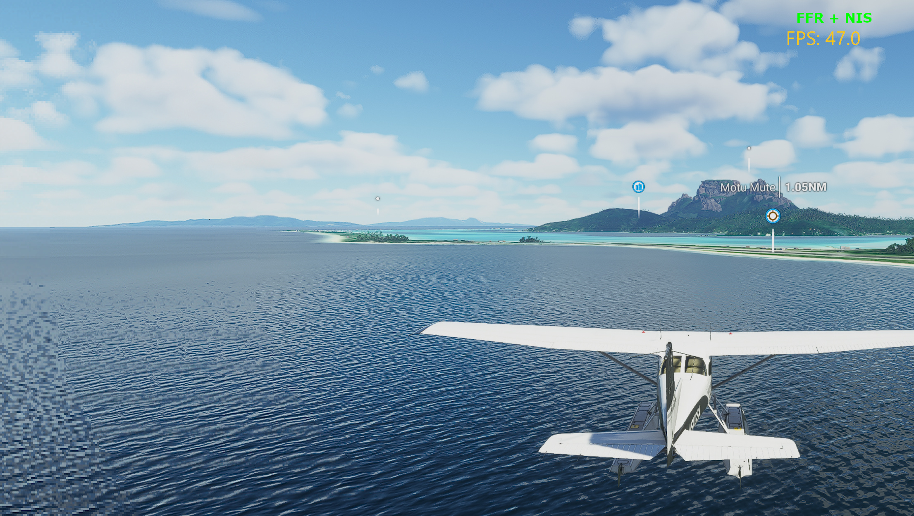

## Table of contents
{: .no_toc .text-delta }

1. TOC
{:toc}

---

## What is Fixed Foveated Rendering?

TODO: Explanation

TODO: Diagram wih 3 rings + list all settings.

 
 
*A comparison of FFR disabled (top) and FFR enabled (bottom)*

In the comparison above, you can see the noticeable difference in quality near the bottom left corner. However, when looking through the lenses of the headset, the difference is barely noticeable.

### Improving the quality of Fixed Foveated Rendering

Certain graphics settings in the application may create additional artifacts. There are a few ways to deal this this situation:

1. Increase the radius values until the degradations are no longer visible (which may lead to a lower gain in frame rate)

2. Find and disable the graphic settings causing the issue (which may lead to a lower fidelity in the scene)

In the example below, we see how the the "Light shafts" feature in Microsoft Flight Simulator 2020 creates undesirable black lines near the horizon line. However, when the feature is disabled, the artifacts are nearly completely gone.

 
*A demonstration of light shafts on (top) and off (bottom) and the impact on visual quality with FFR.*

Another way to reduce or conceal some of the visual artifacts is to use the sharpening features of the NIS or FSR upscalers (see [Upscaling](upscaling)).

Lowering the rendering resolution before the FFR processing happens (ie: the render scale setting within the application) has also shown to create visible artifacts. For this reason, it is also preferred to use the upscaling feature of the OpenXR Toolkit rather than any in-app upscaling.

### Balancing performance and finding the limit of the gain

Configuring a narrower inner and middle regions may improve performance further, however the loss in quality will become more and more noticeable.

 
*FFR with a Narrow pattern.*

In the example above, we show how the Narrow pattern creates a large region at low resolution near the edges of the screen. This region is noticeable even with the distortion created by the lense inside the headset.

It is important to understand that the Variable Rate Shading (VRS) technology employed for FFR is only effective at reducing or eliminating certain bottlenecks of the graphics pipeline.

 
*FFR set to the lowest resolution for the whole screen.*

In the example above, we show how setting the lowest resolution for all 3 regions produces a very low quality image, while not raising the performance over the aggressive settings shown earlier. This is because the limiting factor for performance is no longer at the stage of the graphics pipeline where FFR can help.

**In other words, setting the radius for the inner and outer regions to a lower value does not always result in a higher performance gain.**

### Combining with the upscaling feature

Fixed Foveated Rendering works very well with the [Upscaling](upscaling) feature of the OpenXR Toolkit, and can provide even more boost in performance.

 
*FFR combined with the NIS upscaler in Microsoft Flight Simulator 2020, providing a total boost of 15 FPS.*
