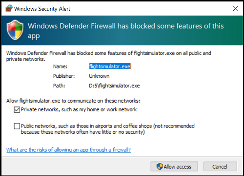
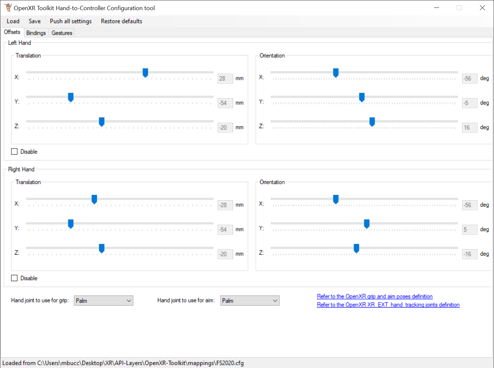
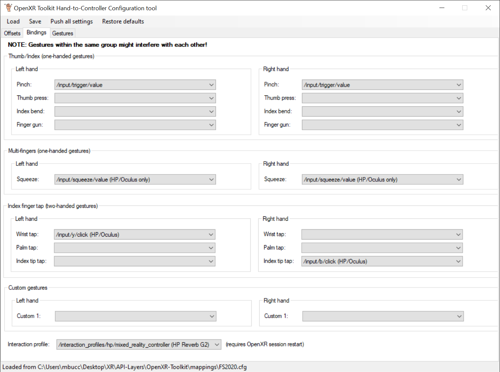
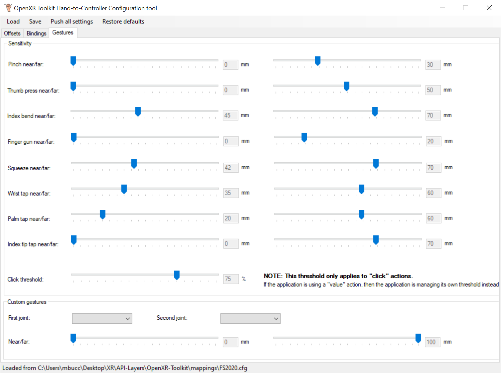

## Table of contents
{: .no_toc .text-delta }

1. TOC
{:toc}

---

## Overview

The OpenXR Toolkit does not add hand tracking capability to your headset, but instead it leverages hand tracking capabilities of some devices (such as the Leap Motion controller) and enable the hand tracking to act as VR controllers.

<br>
*Hand tracking in Microsoft Flight Simulator 2020*

Devices confirmed to work:

* Ultraleap [Leap Motion Controller](https://www.ultraleap.com/product/leap-motion-controller/)
* Ultraleap [Stereo IR 170](https://www.ultraleap.com/product/stereo-ir-170/)
* Pimax [Hand Tracking Module](https://pimax.com/product/hand-tracking-module/)

We would love to add more devices to this list! If you have a device that supports hand tracking via OpenXR that is no on this list, please contact us on [Discord](https://discord.gg/WXFshwMnke) or submit an [issue on GitHub](https://github.com/mbucchia/OpenXR-Toolkit/issues).

## Using with Ultraleap or Pimax devices

1. Download and install the [Leap Motion tracking software](https://developer.leapmotion.com/tracking-software-download).

2. Use the included Visualizer app to confirm that the Leap Motion Controller is properly setup and functional.

3. Download and install the [Ultraleap OpenXR Hand Tracking API Layer](https://github.com/ultraleap/OpenXRHandTracking/releases).

4. With your game running, open the menu (Ctrl+F2), then navigate to **Hand Tracking**. Select either **Both** to use both hands, or **Left**/**Right** to use only one hand. Restart the VR session for the hand tracking to begin.

## Customizing the tracking and gestures

### Per-application configuration file

For each application, the hand tracking experience can be customized through a configuration file.

The OpenXR toolkit may provide a default configuration specific for an app. The preset configuration files are stored in `%ProgramFiles%\OpenXR-Toolkit`, for example `FS2020.cfg` for Microsoft Flight Simulator 2020.

When starting a game or application and hand tracking is enabled, the toolkit will first attempt to load the configuration file from the `%LocalAppData%\OpenXR-Toolkit\configs` folder, then attempt to load the configuration file from the `%ProgramFiles%\OpenXR-Toolkit` folder, before falling back to the built-in defaults if no file was found.

The _OpenXR Hand-to-Controller Configuration tool_ (found in the Start menu) can be used to create configuration files to customize the hand tracking for each game or application.

You may either start from the default configuration, or load one of the existing configurations from the `%ProgramFiles%\OpenXR-Toolkit` folder. Your configuration file can then be saved into the `%LocalAppData%\OpenXR-Toolkit\configs` folder.

The configuration tool also supports live configuration, where every change made in the tool will immediately be applied to the currently running application. **Once satisfied with the configuration, do not forget to save the configuration file!**

For the live configuration feature to work, you need to allow the OpenXR Toolkit through the local firewall when this screen is presented:



#### Naming of the configuration file

The configuration file must use the OpenXR name for the application, **which is not the same as the Windows application name or shortcut name**. To determine the OpenXR name for the application, you must run the application **with hand tracking enabled** (using the in-headset meanu), then inspect the log file (see [Troubleshooting](troubleshooting#inspect-the-log-file)). In the log file, the name of the application will appear with one of the following messages:

```
Loading config for "FS2020"
Could not load config for "FS2020"
```

For this application (Microsoft Flight Simulator 2020), the name of the configuration file **must** be `FS2020.cfg`.

### Prerequisites

The OpenXR Toolkit does not magically add hand tracking to any game or application. It leverages the support for VR controllers, and it translates hand tracking data into simulated VR controller poses (a position and rotation in 3D space) and button inputs.

In order to customize this translation behavior, it is important to understand how hand tracking input is represented. Each hand is decomposed in 26 individually articulated joints: 4 joints for the thumb finger, 5 joints for the other four fingers, and the wrist and palm of the hands. The name an exact position of these joints can be seen below (diagram courtesy of the Khronos group):


The process of translating hand tracking into VR controller input consists of:

- Mapping one or more hand joint poses to the VR controller pose.
- Recognizing gestures (based on hand joints positions relative to each other) and convert them into button inputs.

**Coming up with settings for the configuration tool greatly depends on your preferred experience and the specific mechanics of the game or application. It can be a long and tedious process**.

### Grip and aim poses (_Offsets_ tab)

The application may use two references for tracking of the VR controller: the grip pose and/or the aim pose.

The OpenXR specification describes them as follows:

* grip - A pose that allows applications to reliably render a virtual object held in the user’s hand, whether it is tracked directly or by a motion controller.
* aim - A pose that allows applications to point in the world using the input source, according to the platform’s conventions for aiming with that kind of source.

They can be visualized below (diagram courtesy of the Khronos group):


Some applications use the grip pose, some use the aim pose, and some use both. **You have to experiment**.

When the OpenXR toolkit translates the hand poses into controller poses, it must choose from one of the 26 hand joints pose and optionally perform an additional translation and/or rotation for the resulting controller grip pose or aim pose to be usable.


*The Offsets tab of the configuration tool*

The configutation tool lets you choose which hand joint to use for the grip pose and aim pose, and allows you to apply and additional translation and/or rotation for the final pose.

#### Defaults

When no configuration file is provided, the palm of the hand is used when representing the grip, and the "intermediate" joint of the index finger (see hand joint poses above) is used to represent the aim. No additional translation/rotation is applied.

### Controller bindings (_Bindings_ tab)

#### Gestures definitions

The following gestures are recognized and can be used to trigger the simulated input buttons.

**Important: Some gestures may interfere with each other, and not all gestures should be bound to simulated inputs**. For example the  wrist tap and palm tap gestures are fairly similar, and mapping a distinct input to both of them can lead to false-triggering, or both inputs being simulated at the same time. Care must be taken to not "overload" the gesture bindings.

**Pinch (one-handed)**

Bringing the tip of the thumb and index together.

**Thumb press (one-handed)**

Using the thumb to "press" onto the index finger. The target is the "intermediate" joint of the index finger (see hand joint poses above).

**Index bend (one-handed)**

Bending the index finger in a trigger-like motion.

**Finger gun (one-handed)**

Using the thumb to "press" into the middle finger. The target is the "intermediate" joint of the middle finger (see hand joint poses above). This gesture allows the index finger to be extended (pointing forward).

**Squeeze (one-handed)**

Bending the middle finger, ring finger and little finger in a trigger-like motion.

**Wrist tap (two-handed)**

Using the tip of the index finger from the opposite hand to press on the wrist.

**Palm tap (two-handed)**

Using the tip of the index finger from the opposite hand to press on the center of the palm.

**Index tip tap (two-handed)**

Bring the tip of both index fingers together.

#### Input actions definitions

When translating hand tracking into VR controller inputs, the OpenXR Toolkit must use one of the supported controller type (also called "interaction profile"). It is important to select a controller type that is supported by the game or application. The following types are supported and can be chosen in the configuration tool:

- **/interaction_profiles/microsoft/motion_controller**: The first generation Windows Mixed Reality motion controllers, with a trackpad instead of the A/B/X/Y buttons.
- **/interaction_profiles/hp/mixed_reality_controller**: The HP Reverb motion controllers, with the A/B/X/Y buttons instead of the trackpad.
- **/interaction_profiles/oculus/touch_controller**: The Oculus Touch controller.

Controller inputs are also referred to as "actions", with two main categories of actions:

- **value** actions: the action correspond to triggers with variable positions, where the fingers pressure on the trigger is reported as a decimal value between 0 and 1.
- **click** actions: the action corresponds to a button that is either pressed or not pressed.

Each controller input is identified with an action path, which contains both a unique identifier for the input (such as a description of the input or the label on a button) and the type of input (`value` or `click`). The supported action paths are the following:

- **/input/menu/click**: The menu button.
- **/input/trigger/value**: The controller trigger.
- **/input/squeeze/value**: The "grab" trigger. This action is only supported on HP Reverb motion controllers or Oculus Touch controllers.
- **/input/squeeze/click**: The "grab" button (for controllers that do not have a grab trigger).
- **/input/x/click** (left only): The X button.
- **/input/y/click** (left only): The Y button.
- **/input/a/click** (right only): The A button.
- **/input/b/click** (right only): The B button.
- **/input/thumbstick/click**: The thumbstick being pushed down.
- **/input/system/click**: Emulates pressing the Windows button.
- **/input/trackpad/click**: The trackpad being pushed down. This action is only supported on first generation Windows Mixed Reality motion controllers.


*The Bindings tab of the configuration tool*

The configutation tool lets you choose the interaction profile (type of controller) to simulate and bind the gestures to corresponding simulated button inputs.

#### Defaults

When no configuration file is provided, an HP Reverb motion controller is simulated, with the following gestures bound:
- The index bend gesture on both hands is bound to the controller trigger.
- The squeeze gesture on both hands is bound to the controller grab trigger or button.
- Tapping the left wrist is bound to the left controller's menu button.
- The index tip tap gesture is bound to the right controller's B button.

### Sensitivity (_Gestures_ tab)

Each gesture described above produces a decimal "output value" between 0 and 1. This value is based on the distance between the hand joints involved for the gesture. When at rest, the value must be 0. The closer the hand joints are from each other, the closer to 1 the value is.

The "far distance" for a gesture corresponds to the when the output value maps to 0. Any distance larger than the far distance will produce an output of 0.

The "near distance" for a gesture corresponds to the when the output value maps to 1. Any distance smaller than the far distance will produce an output of 1.

Example: With a near distance of 10mm and a far distance of 60mm for pinching:
- When the tip of the thumb and index fingers are 60mm or more apart, the output value will read 0 (equivalent to the controller’s trigger being at rest for example).
- When the tip of the thumb and index fingers are 10mm or less apart, the output value will read 1 (equivalent to the controller’s trigger being fully pressed).
- When the tip of the thumb and index finger are 35mm apart, this output value reads 0.5 (because 35 is half-way between 10 and 60, equivalent to the trigger being pressed half of the way).

Adjusting the near and far distances effectively allows to modify the sensitivity of each gesture.

Another parameter, the "click threshold ", allows to modify the sensitivity of the click actions. As described earlier, click actions correspond to a button that is either pressed or not pressed. The click threshold determine the output value above which a gesture results in a click action being pressed. If the output value for a gesture is below the click threshold, then the button is reported not pressed. If the output value is greater or equal to the click threshold, the the button is reported pressed.


*The Gestures tab of the configuration tool*

The configutation tool lets you customize the near and far distance for each gesture, along with the click threshold.

The [Detailed overlay](overlay) can be used to view the current output value for each gesture, and should be used to tune the near and far distances and the click threshold.
