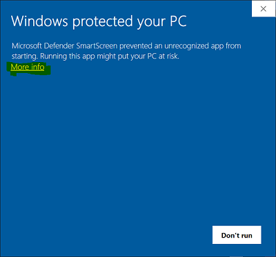
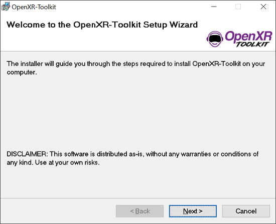
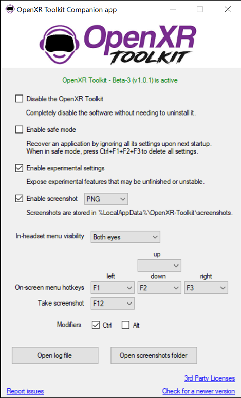
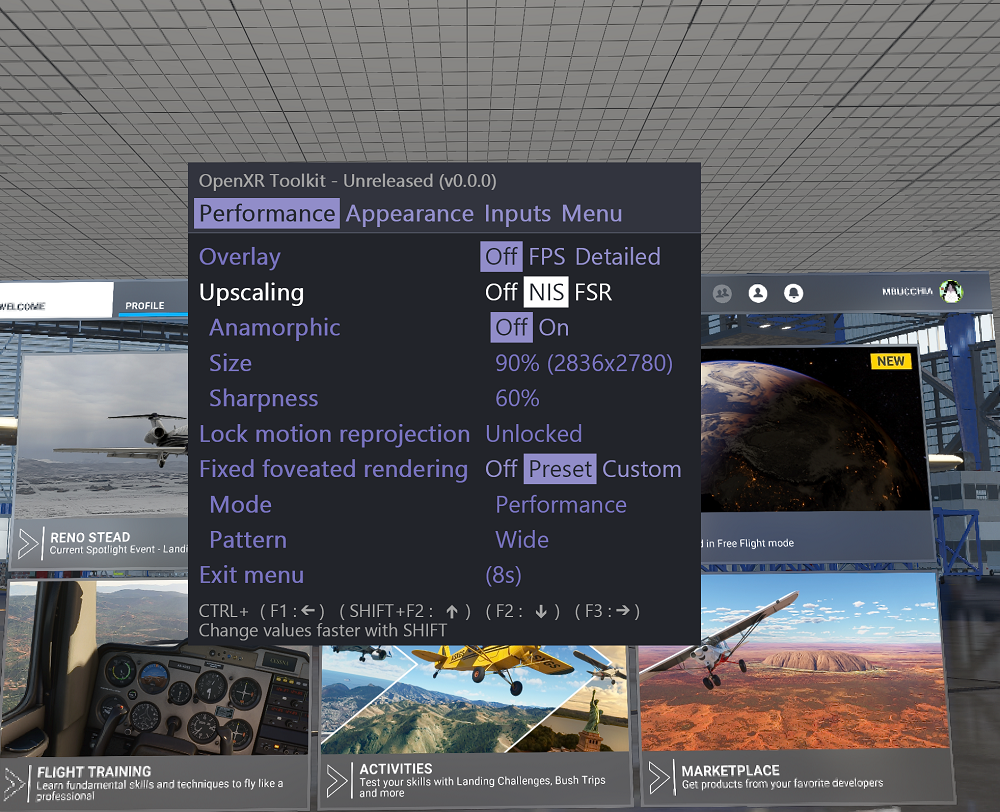
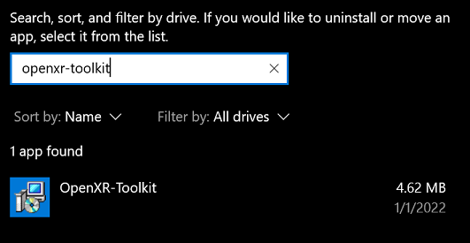

# OpenXR Toolkit

This software provides a collection of useful features to customize and improve existing OpenXR applications, including render upscaling and sharpening, hand tracking to controller input simulation (on supported devices only) and other game-enhancing tweaks.

For more details on how it works, see the [How does it work?](how-does-it-work).

DISCLAIMER: This software is distributed as-is, without any warranties or conditions of any kind. Use at your own risks.

# Setup

## Downloads

[Download the latest](https://github.com/mbucchia/OpenXR-Toolkit/releases/download/0.9.5/OpenXR-Toolkit.msi){: .btn .btn-blue }

...or expore [all versions](https://github.com/mbucchia/OpenXR-Toolkit/releases).

## Requirements

This software may be used with any brand of VR headset as long as the target application is developed using OpenXR. This software may be used with any GPU compatible with DirectX 11 and above.

## Limitations

+ This software was only extensively tested with Microsoft Flight Simulator 2020, it appears to work with War Thunder as well. Other applications are untested.
  + Contrary to popular belief, this software will not work with OpenVR-based games, like the majority of games you can find on Steam.
+ The brand new Varjo Aero headset is not supported (we are working on it);
+ The HTC Vive Pro 2 and Vive Cosmos headsets are not supported (but the original Vive Pro was reported to work);
+ The menu does not display correctly on Pimax headsets;
+ See the [open bugs](https://github.com/mbucchia/OpenXR-Toolkit/issues?q=is%3Aopen+is%3Aissue+label%3Abug).

For future plans, see the [Roadmap](roadmap).

## Installation

Video tutorial by [PIE IN THE SKY TOURS](https://www.youtube.com/c/pieintheskytours):

<iframe width="560" height="315" src="https://www.youtube.com/embed/QelydCFe0aQ" title="YouTube video player" frameborder="0" allow="accelerometer; autoplay; clipboard-write; encrypted-media; gyroscope; picture-in-picture" allowfullscreen></iframe>

**Note: if you use the previous NIS Scaler or Hand-To-Controller layer before, please uninstall them now**.

Run the `OpenXR-Toolkit.msi` program.

You may be warned that this software is not signed. We are working on signing the software through a reputable organization, but in the meantime, you must bypass this warning ("More info" then "Run anyway").

Follow the instructions to complete the installation procedure.

Once installed, you can use the _OpenXR Toolkit Companion app_ (found on the desktop or Start menu) to confirm that the software is active.

The _OpenXR Toolkit Companion app_ will display a green or red status indicating whether the software is activated.

The companion app may be used sporadically to enable or disable advanced features or perform recovery (see further below). The actual settings for the toolkit are available from within your OpenXR application (see below). You do not need to open the companion app to use the software and to manage the settings.

# Basic usage

Once installed, please run the desired OpenXR application and use the Ctrl+F2 key combination to enter the configuration menu. **Note: the key combination may be changed from the _OpenXR Toolkit Companion app_**.

The first few times a new application is started, a reminder message will appear on the screen: it confirms that the software is operating properly.

Use Ctrl+F2 to move to the next option (next line) in the menu. Use Ctrl+F1 (respectively Ctrl+F3) to move selection left (respectively right) or decrease (respectively increase) the value of an option. **Note: the key combinations may be changed from the _OpenXR Toolkit Companion app_**.

When changing the value for an option, hold Shift in addition to the Ctrl key in order to advance faster in the values.

**Important: when starting an application for the first time, use the configuration menu to adjust the _Menu eye offset_ until the text appears correctly (eg: no "double vision")**:

## Available options

See [Features](features) for more details.

- **Overlay**: Enables the FPS display in the top-right corner of the view. _Please note that the overlay may reduce performance_. A third option - "_Detailed_" - is available in experimental mode and may be used for advanced performance monitoring.
- **Upscaling**: Enables the use of an upscaler such as NIS or FSR to perform rendering at a lower resolution, and upscale and/or sharpen the image. Requires to restart the VR session.
- **Factor** (only when _Upscaling_ is enabled): The upscaling factor (ie: the percentage of magnification of the rendering resolution). The resolution displayed next to the percentage is the effective resolution that the application sees. Requires to restart the VR session.
- **Sharpness** (only when _Upscaling_ is enabled): The sharpness factor. Has a different scale/effect between NIS and FSR.
- **World scale**: The Inter-Camera Distance override, which can be used to alter the world scale.
- **Prediction dampening**: The prediction override, which can be use to dampen the prediction for head, controllers, and hand movements.
- **Hand tracking** (only when hand tracking is supported by the system): Enable the use of hand tracking in place of the VR controller. Requires a compatible device, such as the Leap Motion. Either or both hands can be enabled at the same time. Requires to restart the VR session when toggling on or off. 
- **Hands visibility** (only when _Hand tracking_ is enabled): Whether the hands are displayed and what color tone to use.
- **Hands timeout** (only when _Hand tracking_ is enabled): The amount of time after losing track of the hands before simulator shutdown of the simulated VR controller.
- **Font size**: The size of the text for the menu.
- **Menu timeout**: The duration after which the menu automatically disappears when there is no input.
- **Menu eye offset**: Adjust rendering of the menu until the text appears clear.

# Recovery

See [Troubleshooting](troubleshooting) for more details.

If changing some settings render the application unusable, use Ctrl+F1+F2+F3 to hard reset all settings.

**Note: if the key combinations were changed from the _OpenXR Toolkit Companion app_, please use the newly assigned keys**.

 If an application can no longer start, use the _OpenXR Toolkit Companion app_ (found on the desktop or Start menu) and select the Safe mode before starting the application, then use Ctrl+F1+F2+F3 (regardless of custom key combinations) to hard reset all settings.

# Removal

The software can be removed from Windows' _Add or remove programs_ menu.

In the list of applications, select _OpenXR-Toolkit_, then click _Uninstall_.

