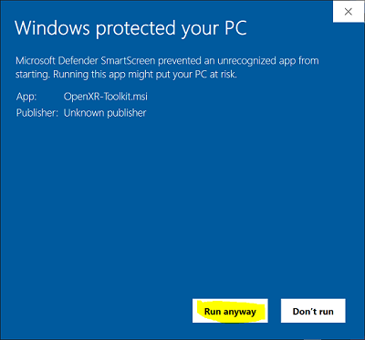
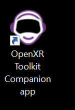
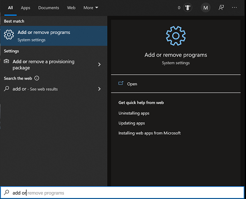

# OpenXR Toolkit

This software provides a collection of useful features to customize and improve existing OpenXR applications, including render upscaling and sharpening, hand tracking to controller input simulation (on supported devices only) and other game-enhancing tweaks.

For more details on how it works, see the [How does it work?](how-does-it-work).

DISCLAIMER: This software is distributed as-is, without any warranties or conditions of any kind. Use at your own risks.

# Setup

## Downloads

Current version: **Beta #2 Hotfix #3 (0.9.7)**

[Download the latest](https://github.com/mbucchia/OpenXR-Toolkit/releases/download/0.9.7/OpenXR-Toolkit.msi){: .btn .btn-blue }

...or expore [all versions](https://github.com/mbucchia/OpenXR-Toolkit/releases).

## Requirements

This software may be used with any brand of VR headset as long as the target application uses any GPU compatible with DirectX 11 and above, and is developed using OpenXR.

The following OpenXR ToolKit features have additional restrictions:

+ Fixed foveated rendering is only supported with the following GPUs:
  + NVIDIA GeForce GTX 1600 series and RTX series, both DX11 and DX12.
  + AMD RX 6000 series, with DX12 only.

## Limitations

+ This software was only extensively tested with Microsoft Flight Simulator 2020.
+ Other applications are untested but it appears to work with War Thunder as well.
+ It is also expected this software should work with most Steam games if they are using OpenXR (instead of Steam's OpenVR).
+ The menu does not display correctly on Pimax headsets;
+ See the [open bugs](https://github.com/mbucchia/OpenXR-Toolkit/issues?q=is%3Aopen+is%3Aissue+label%3Abug).

For future plans, see the [Roadmap](roadmap).

## Installation

Video tutorial by [PIE IN THE SKY TOURS](https://www.youtube.com/c/pieintheskytours):

<iframe width="560" height="315" src="https://www.youtube.com/embed/QelydCFe0aQ" title="YouTube video player" frameborder="0" allow="accelerometer; autoplay; clipboard-write; encrypted-media; gyroscope; picture-in-picture" allowfullscreen></iframe>

#### ⚠️ if you are using the previous NIS Scaler or Hand-To-Controller layer before, please uninstall them now.

### 1. Run the `OpenXR-Toolkit.msi` program.

NOTE: _You may be warned that Windows protected your PC because this software is not signed yet. We are working on signing the software through a reputable organization and in the the meantime you can proceed with the following steps_.

Proceed through the "Windows protected your PC" warning...

#### Select `More info` then `Run anyway`

 

### 2. Follow the instructions to complete the installation procedure.

### 3. Launch the _OpenXR Toolkit Companion app_ to confirm that the software is active.

You can use the shorcut found on the desktop or in the Start menu...

  

The _OpenXR Toolkit Companion app_ may be used sporadically to enable or disable advanced features or perform recovery (see further below). The application displays a green or red status indicating whether the software OpenXR component is active:

💡 You don't need to keep the companion app running in order to use the software: the actual settings for the toolkit are available from within your OpenXR application and display directly in the headset! (see below). 

# Basic usage

Once installed, please run the desired OpenXR application and use `CTRL+F2` to open the configuration menu:

In order to navigate the menu, select options and change values:

- Use `CTRL+F2` to move to the next option (next line) in the menu.
- Use `CTRL+F1` to move selection to the left / decrease the option value.
- Use `CTRL+F3` to move selection to the right / increase the option value.
- Hold both `SHIFT` and `CTRL` together to change values fasters.

💡 Use the _OpenXR Toolkit Companion app_ to change the default shortcut keys.

💡 When starting an application for the first time, use the configuration menu to adjust the _Menu eye offset_ until the text appears correctly (eg: no "double vision").

NOTE: the first few times you're using the OpenXR Toolkit with a new application, a convenient reminder message will appear in the headset and confirms whether the software is operating properly.

On-screen indicator...

  
## Available options

See [Features](features) for more details.

**Performance** tab:
- **Overlay**: Enables the FPS display in the top-right corner of the view. _Please note that the overlay may reduce performance_. A third option - "_Detailed_" - is available in experimental mode and may be used for advanced performance monitoring.
- **Upscaling**: Enables the use of an upscaler such as NIS or FSR to perform rendering at a lower resolution, and upscale and/or sharpen the image. Requires to restart the VR session.
  - **Anamorphic**: TODO
  - **Size**: The upscaling factor (ie: the percentage of magnification of the rendering resolution). The resolution displayed next to the percentage is the effective resolution that the application sees. Requires to restart the VR session.
  - **Width/Height**: TODO
  - **Sharpness**: The sharpness factor. Has a different scale/effect between NIS and FSR.
  - **Mip-map bias** (Expert setting): TODO
- **Lock motion reprojection** (only with Windows Mixed Reality): Disable automatic motion reprojection adjustment, and lock the frame rate to the desired fraction of the refresh rate.
- **Fixed foveated rendering**: TODO
  - **Mode** (with _Preset_ mode): Whether to prefer performance over quality.
  - **Pattern** (with _Preset_ mode): The size of the foveated regions.
  - **Inner resolution** (with _Custom_ mode, Expert setting): The resolution inside the inner ring of foveation. Should be left at full resolution (1x).
  - **Inner ring size** (with _Custom_ mode): The size of the inner ring of foveation, in percent of the height of the image.
  - **Middle resolution** (with _Custom_ mode): The resolution inside the middle ring of foveation.
  - **Outer ring size** (with _Custom_ mode): The size of the ouner ring of foveation, in percent of the height of the image.
  - **Outer resolution** (with _Custom_ mode): The resolution inside the outer ring of foveation.
  - **Horizontal offset** (with _Custom_ mode, Expert setting): Add a horizontal offset to the center of the foveation rings. The offset is expressed relative to the left eye, and its opposite value will be applied to the right eye.
  - **Horizontal scale** (with _Custom_ mode, Expert setting): The rings for foveation can be configured as ellipses. This setting controls the scale of the horizontal radius (or semi-major axis) based on the vertical radius (or semi-minor axis). A value of 100% means that the rings are circles. A value larger than 100% will result in flattened, oval-shaped rings.
  - **Vertical offset** (with _Custom_ mode, Expert setting): Add a vertical offset to the center of the foveation rings.

**Appearance** tab:
- **Brightness**: Adjust the brightness of the image.
- **Contrast**: Adjust the contrast of the image.
- **Saturation**: Adjust the saturation of the image.
  - **Ajustment** (with _Global_ mode): Adjust all colors at once.
  - **Red**, **Green**, **Blue** (with _Selective_ mode): Adjust each primary color individually.
- **Field of view**: TODO
- **World scale**: The Inter-Camera Distance override, which can be used to alter the world scale.

**Inputs** tab:
- **Shaking reduction**, formerly **Prediction dampening** (only when supported by the system): The prediction override, which can be use to dampen the prediction for head, controllers, and hand movements.
- **Controller emulation** (only when hand tracking is supported by the system): Enable the use of hand tracking in place of the VR controller. Requires a compatible device, such as the Leap Motion. Either or both hands can be enabled at the same time. Requires to restart the VR session when toggling on or off. 
  - **Hands skeleton**: Whether the hands are displayed and what color tone to use.
  - **Controller timeout**: The amount of time after losing track of the hands before simulator shutdown of the simulated VR controller.

**Menu** tab:
- **Show expert settings**: Show all settings. *This can be pretty overwhelming for certain features*.
- **Font size**: The size of the text for the menu.
- **Menu timeout**: The duration after which the menu automatically disappears when there is no input.
- **Menu eye offset**: Adjust rendering of the menu until the text appears clear.

# Recovery

See [Troubleshooting](troubleshooting) for more details.

If changing some settings render the application unusable, use Ctrl+F1+F2+F3 to hard reset all settings.

**Note: if the key combinations were changed from the _OpenXR Toolkit Companion app_, please use the newly assigned keys**.

 If an application can no longer start, use the _OpenXR Toolkit Companion app_ (found on the desktop or Start menu) and select the Safe mode before starting the application, then use Ctrl+F1+F2+F3 (regardless of custom key combinations) to hard reset all settings.

# Removal

The software can be removed from Windows' _Add or remove programs_ menu.

In the list of applications, select _OpenXR-Toolkit_, then click _Uninstall_.

