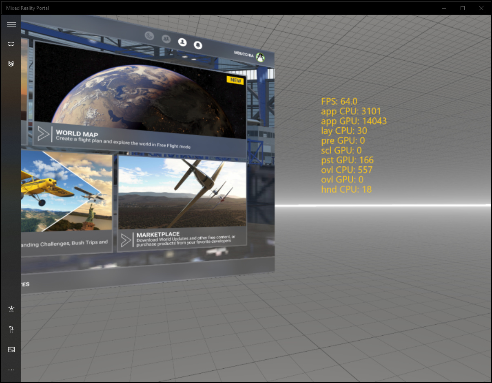

## Table of contents
{: .no_toc .text-delta }

1. TOC
{:toc}

---

## Enabling the overlay

In order to enable the detailed overlay, you must check the _Enable experimental settings_ box in the _OpenXR Toolkit Companion app_. The detailed overlay will then be unlocked from the in-headset menu.

 
*The detailed overlay*

## Detailed metrics

_Note_: All durations are in microseconds.

* **app CPU**: The time spent (on CPU) by the application to produce a frame.
* **app GPU**: The time spent (on GPU) by the application to produce a frame. **Note than if the application is CPU-bound, this value may be incorrect or inaccurate**.
* **lay CPU**: The overhead (on CPU) of the OpenXR Toolkit.
* **pre GPU**: The time spent (on GPU) in the pre-processing by the OpenXR Toolkit.
* **scl GPU**: The time spent (on GPU) to do upscaling by the OpenXR Toolkit.
* **pst GPU**: The time spent (on GPU) in the post-processing by the OpenXR Toolkit.
* **ovl CPU**: The time spent (on CPU) to draw the OpenXR Toolkit menu/overlays.
* **ovl GPU**: The time spent (on GPU) to draw the OpenXR Toolkit menu/overlays.
* **hnd CPU**: The time spent (on CPU) to query the hand tracking driver.

### Gesture state

For each gesture that is **currently bound to an input**, the current input value is shown for each hand. If a gesture is not bound, the value reported will be `nan` (Not A Number). The input value is enveloped by the Near and Far settings that can be configured with the _OpenXR Toolkig Hand-to-Controller Configuration tool_. See the [Hand tracking](hand-tracking) feature for more details on setting up gestures.
