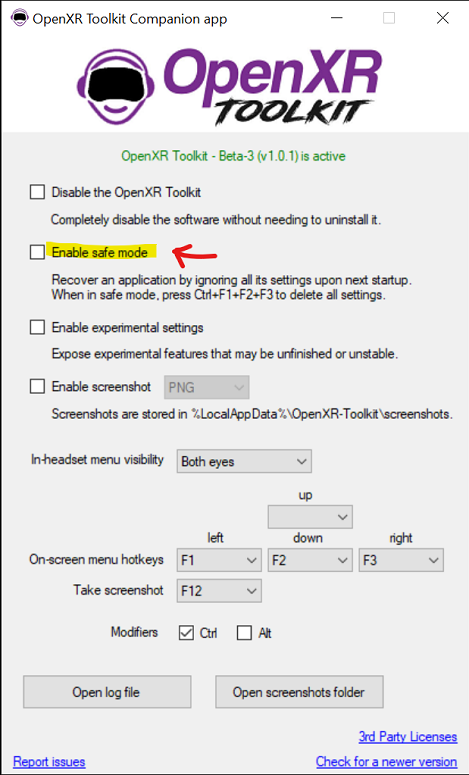
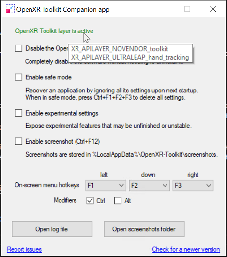

## Table of contents
{: .no_toc .text-delta }

1. TOC
{:toc}

---

## Menu is not showing

This has been reported due to certain keyboards requiring special key presses to use the Function keys (such as Fn+F1 for example). This can also be due to 3rd party software intercepting the Function keys.

Please use the _OpenXR Toolkit Companion app_ to try different hotkeys, selecting keys other than the Function keys.

## Reset all the settings

While an application is running, you may at any point reset all the settings to their default values by pressing simultaneously the keys bound to all 3 of the menu actions. If no custom key combinations have been set in the _OpenXR Toolkit Companion app_, this combination is Ctrl+F1+F2+F3.

## Start in Safe mode

If an application fails to start due to some settings changes, you may use the  _OpenXR Toolkit Companion app_ (found on the desktop or Start menu) to _Enable safe mode_. In this mode, the settings for this application will not be loaded.

<br>
*Enabling safe mode*

You may then either:

- Reset all the settings (see above) with the Ctrl+F1+F2+F3 key combination.

- Change your settings to avoid the problem. Note that in safe mode, settings are not loaded, but the modified settings are still stored.

## Inspect the log file

In order to inspect the log file to try to understand issues with the toolkit, you may open the _OpenXR Toolkit Companion app_ (found on the desktop or Start menu) and click the _Open log file_ button. This will open the file located at `%LocalAppData%\OpenXR-Toolkit\logs`.

Please note that certain applications may run in a security-sandbox environment. In this case, the log file may be located under the corresponding application subfolder in `%LocalAppData%\Packages`. You may search for a file named `XR_APILAYER_NOVENDOR_toolkit.log` if unsure of the exact location.

<br>
*An example log file*

## Missing DirectX legacy runtime

Check for the following error in the log file:

```
[OXRTK] 2022-02-28 20:41:32 -0600: HRESULT failure [80004005]
Origin: m_fontWrapperFactory->CreateFontWrapper(get(m_device), m_fontFamily.c_str(), set(m_fontNormal))
```

To solve this problem, please install the [DirectX legacy runtime package](https://www.microsoft.com/en-us/download/details.aspx?id=35).

## Confirming that the Ultraleap OpenXR layer is active

**Note: this is applicable for troubleshooting hand tracking with Ultraleap devices only.**

To confirm that the Ultraleap OpenXR layer is active and loaded in the correct order, open the _OpenXR Toolkit Companion app_ (found on the desktop or Start menu) and hover the mouse cursor on the _OpenXR Toolkit layer is active_ label.

<br>
*Listing the OpenXR layers*

The `XR_APILAYER_ULTRALEAP_hand_tracking` layer **must** appear after the `XR_APILAYER_NOVENDOR_toolkit` layer. If this is not the case, you may re-install either one of the layers to correct the order.

## Asking for help

Some issues may be known by the community. Please read the Support channels on our [Discord server](https://discord.gg/WXFshwMnke) and ask questions there if you do not find the answer already.

## Filing a bug report

**Note: please do not file issues for questions about tuning of the settings.** Use the [Discord server](https://discord.gg/WXFshwMnke) for that.

When filing an issue [on GitHub](https://github.com/mbucchia/OpenXR-Toolkit/issues?q=is%3Aissue+is%3Aopen+label%3Abug), it is important to include:

- A good problem description. What were you trying to do? What did you expected to happen? What happened instead?
- Include the application or game and its version, the make and model of VR device.
- If possible, include the version of the OpenXR runtime and the make and model of GPU (if you are going to attach your log file, the information is included in it and may be omitted in the description).

**There are templates providing fields to input all this information. Please use the templates.**.

Please include the log file (see above how to retrieve it) **as an attachment**.

If applicable, you may include screenshots (see [Other features](other-features)).

Thank you for taking the time to report issue and help us improve the software!
